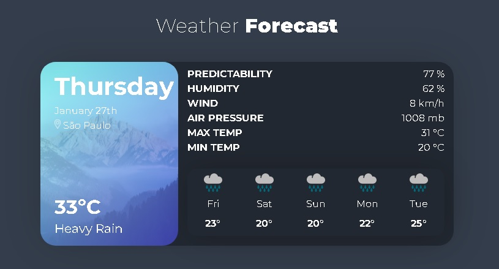

<h1 align="center">
  Weather Forecast
</h1>
</h1>

  <a href="#-tecnologias">Tecnologias</a>&nbsp;&nbsp;&nbsp;|&nbsp;&nbsp;&nbsp;
  <a href="#-projeto">Projeto</a>&nbsp;&nbsp;&nbsp;|&nbsp;&nbsp;&nbsp;
  <a href="#memo-licença">Licença</a>&nbsp;&nbsp;&nbsp;|&nbsp;&nbsp;&nbsp;

 

  

## 🚀 Tecnologias

Esse projeto foi desenvolvido com as seguintes tecnologias:

-   HTML
-   CSS
-   Bootstrap
-   React.js
-   Axios

Utilitários

-   [Weather API](https://www.metaweather.com/api/)
-   [Axios](https://www.npmjs.com/package/axios)
-   [Moment](https://www.npmjs.com/package/react-moment)
-   [Bootstrap](https://react-bootstrap.github.io/)

## 💻 Projeto

⚡ Aplicação meteorológica desenvolvida em React.js utilizando a Weather API e Axios.

## 📝 Licença

Esse projeto está sob a licença MIT.
